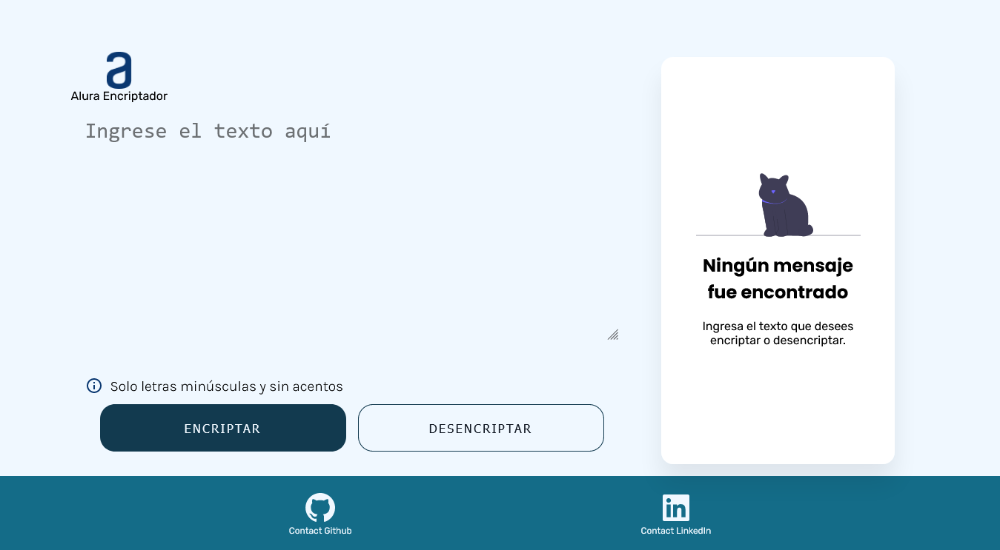
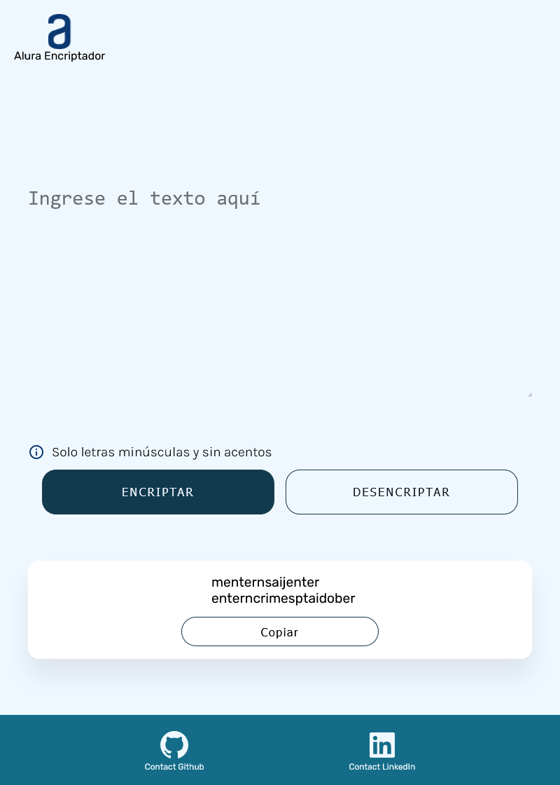

# Encriptador Alura
This is a solution to the challenge [Proyecto encripador de Alura](https://www.aluracursos.com/challenges/challenge-one-logica/sprint01-construye-un-encriptador-texto-con-javascript).

## Table of contents

- [Overview](#overview)
  - [The challenge](#the-challenge)
  - [Screenshot](#screenshot)
  - [Link](#links)
- [My process](#my-process)
  - [Built with](#built-with)
  - [What I learned](#what-i-learned)
  - [Useful resources](#useful-resources)
- [Author](#author)
- [Acknowledgments](#acknowledgments)

## Overview

### The challenge

Users should be able to:

- View the optimal layout for the app depending on their device's screen size
- See hover states for all interactive elements on the page
- Recive user input to encrypt the input recived
- Copy the user input on clipboard.

### Screenshot

### Link

- Live site URL: [Encriptador Alura](https://your-solution-url.com)

### Built with

- Semantic HTML5 markup
- CSS custom properties
- Flexbox
- CSS Grid
- Mobile-first workflow
- Javascript

### What I learned
To use Regular expresions and replace method to change a string with the specific data I want.

### Useful resources
[AlexCG CSS Course](https://www.youtube.com/watch?v=WfDqFArJnYA&t=20416s) - this helped me a lot with all CSS understanding.

[Regular expresion Youtube video](https://www.youtube.com/watch?v=dzLbz3AFylE&t=701s) - So usefull for regular expresions understanding.

[MDN Web Docs](https://developer.mozilla.org/es/) - Mozilla´s documentation about HTML, CSS and Javascript.

## Author

- Carlos Fernando Hernández Caro - [Linked in website](https://www.linkedin.com/in/fernando-hernandez-a5b7b4251/).
